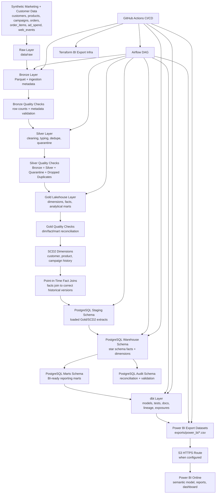

# Marketing Lakehouse & Customer Warehouse Reporting Platform

## 1. Overview

End-to-end marketing analytics platform combining lakehouse processing, PostgreSQL warehouse modeling, dbt analytics engineering, Airflow orchestration, Power BI Online reporting, Terraform-backed BI exports, and GitHub Actions CI/CD validation.

This repository started as a batch marketing lakehouse and has been extended into one merged production-style analytics platform. The lakehouse engine remains the foundation: it generates synthetic marketing/customer data, processes it through Raw, Bronze, Silver, and Gold layers, applies quality checks, handles quarantined records, and produces business-ready marts. The warehouse/reporting layer then promotes trusted Gold outputs into PostgreSQL schemas, models SCD Type 2 dimensions and fact tables, validates point-in-time correctness, builds BI-ready marts, exports dashboard datasets, and documents Power BI Online proof assets.

The result is one coherent data product:

```text
Lakehouse engine → PostgreSQL warehouse → dbt validation → Airflow orchestration → Power BI Online reporting → GitHub Actions quality gate
```

---

## 2. What This Platform Proves

This project demonstrates practical Data Engineering and Analytics Engineering capabilities across the full analytics lifecycle:

| Capability | What this repo proves |
|---|---|
| Lakehouse processing | Raw, Bronze, Silver, and Gold Medallion layers using PySpark and Parquet |
| Data quality | Row-count checks, metadata checks, null checks, metric checks, quarantine handling, and reconciliation |
| Warehouse modeling | PostgreSQL staging, warehouse, marts, and audit schemas |
| Historical correctness | SCD Type 2 customer/product/campaign dimensions and point-in-time fact joins |
| BI readiness | Revenue, campaign, product, customer, and funnel marts built for reporting |
| Analytics engineering | dbt models, tests, docs, lineage, and exposures |
| Orchestration | Airflow DAGs coordinating lakehouse, warehouse, dbt, and reporting tasks |
| Reporting | Power BI Online dashboard assets, screenshots, CSV exports, and refresh flow documentation |
| Infrastructure | Terraform-backed BI export infrastructure where configured |
| CI/CD | GitHub Actions validates SQL, dbt, Airflow, Power BI assets, Terraform assets, and repo hygiene |

---

## 3. End-to-End Architecture

```text
Synthetic Marketing + Customer Data
        ↓
Raw Lakehouse Layer
        ↓
Bronze Lakehouse Layer
        ↓
Bronze Quality Checks
        ↓
Silver Lakehouse Layer
        ↓
Silver Quality Checks + Quarantine
        ↓
Gold Lakehouse Layer
        ↓
Gold Quality Checks
        ↓
SCD2 Historical Modeling Layer
        ↓
Point-in-Time Fact Join Layer
        ↓
PostgreSQL Warehouse
        ↓
dbt Analytics Engineering Layer
        ↓
PostgreSQL BI Marts
        ↓
CSV Exports / S3 HTTPS Route
        ↓
Power BI Online Reports and Dashboard
        ↓
GitHub Actions CI/CD Validation
```

Project 2 remains the lakehouse engine. The former Project 3 scope now lives inside the same repository as the PostgreSQL warehouse, dbt, BI, reconciliation, and reporting layer.

---

## 4. Mermaid Architecture Diagram



---

## 5. What Each Layer Owns

| Layer | Path / System | Ownership |
|---|---|---|
| Synthetic source | `data-generator/generate_data.py` | Generates marketing, customer, campaign, order, product, ad spend, and web event data |
| Raw | `data/raw/` | Stores original generated files without cleaning |
| Bronze | `data/bronze/` | Preserves source fidelity and adds ingestion metadata |
| Silver | `data/silver/` | Cleans, standardizes, deduplicates, validates, and prepares trusted records |
| Quarantine | `data/quarantine/` | Stores invalid records instead of silently dropping them |
| Gold | `data/gold/` | Produces business-ready facts, dimensions, and lakehouse marts |
| SCD2 bridge | Gold/SCD2 outputs | Preserves customer/product/campaign history for warehouse joins |
| PostgreSQL staging | `staging` schema | Loads trusted Gold/SCD2 extracts into relational staging |
| PostgreSQL warehouse | `warehouse` schema | Stores star-schema facts and SCD2 dimensions |
| PostgreSQL marts | `marts` schema | Provides BI-ready reporting objects |
| PostgreSQL audit | `audit` schema | Stores reconciliation and validation outputs |
| dbt | `dbt/` | Adds analytics engineering models, tests, docs, lineage, and exposures |
| Airflow | `airflow/dags/` | Orchestrates lakehouse, warehouse, dbt, and export tasks |
| Power BI exports | `exports/power_bi/` | Stores CSV datasets consumed by Power BI Online |
| Power BI screenshots | `screenshots/power_bi/`, `docs/screenshots/power_bi/` | Provides dashboard proof assets |
| Terraform | `terraform/aws-bi-exports/` | Defines BI export infrastructure where configured |
| CI/CD | `.github/workflows/ci.yml` | Validates the merged analytics platform before merge |

---

## 6. Tech Stack

| Area | Technology |
|---|---|
| Language | Python |
| Batch processing | PySpark |
| Storage format | Parquet |
| Lakehouse pattern | Raw, Bronze, Silver, Gold Medallion Architecture |
| Local analytics | DuckDB |
| Warehouse database | PostgreSQL 16 |
| Analytics engineering | dbt |
| Orchestration | Apache Airflow |
| BI/reporting | Power BI Online |
| BI exports | CSV datasets, S3 HTTPS route where configured |
| Infrastructure | Terraform |
| CI/CD | GitHub Actions |
| Container runtime | Docker |
| Development environment | Ubuntu, VS Code |

---

## 7. Data Sources

The synthetic generator creates marketing and customer behavior data.

Generated raw files:

| File | Description |
|---|---|
| `customers.csv` | Customer profile data |
| `products.csv` | Product catalog data |
| `campaigns.csv` | Marketing campaign master data |
| `orders.csv` | Order-level transaction data |
| `order_items.csv` | Product-level order line items |
| `ad_spend.csv` | Campaign spend, impressions, and clicks |
| `web_events.json` | User behavior and engagement events |

The behavioral event source includes customer, product, session, recommendation, campaign attribution, device/browser, engagement, fraud, schema version, and timestamp fields.

---

## 8. Lakehouse Engine

The lakehouse engine processes generated source data through Medallion layers.

### Raw

```text
data/raw/batch_date=YYYY-MM-DD/
```

Raw stores the original generated source files exactly as received.

### Bronze

```text
data/bronze/
```

Bronze converts raw files into Parquet and adds ingestion metadata such as ingestion timestamp, ingestion date, batch ID, source system, source file name, and record hash.

### Silver

```text
data/silver/
data/quarantine/
```

Silver performs cleaning, type casting, timestamp parsing, validation, deduplication, and quarantine handling.

Invalid records are written to quarantine instead of being silently removed.

### Gold

```text
data/gold/
```

Gold creates business-ready facts, dimensions, and analytical marts.

Gold outputs include:

```text
dim_customers
dim_products
dim_campaigns
fact_orders
fact_order_items
fact_ad_spend
fact_web_events
mart_campaign_performance
mart_product_performance
mart_customer_value
mart_marketing_funnel
```

---

## 9. Warehouse Layer

The warehouse layer promotes trusted Gold/SCD2 outputs into PostgreSQL.

Main schemas:

| Schema | Purpose |
|---|---|
| `staging` | Loaded Gold/SCD2 extracts from the lakehouse |
| `warehouse` | Star-schema dimensions and facts |
| `marts` | BI-ready reporting marts |
| `audit` | Reconciliation and validation checks |

Warehouse capabilities:

- SCD Type 2 customer, product, and campaign dimensions.
- Surrogate keys for historical dimension versions.
- Point-in-time fact joins.
- Unknown-member handling where needed.
- BI-ready marts for revenue, campaign, product, customer, and funnel reporting.
- Reconciliation checks stored under the audit layer.
- Query performance tuning through indexes and `EXPLAIN ANALYZE` documentation.

Main SQL assets:

```text
sql/warehouse/create_schemas.sql
sql/warehouse/load_gold_to_staging.sql
sql/warehouse/create_warehouse_tables.sql
sql/warehouse/create_marts.sql
sql/warehouse/create_indexes.sql
sql/warehouse/reconciliation_report.sql
sql/warehouse/scd2_validation_queries.sql
sql/warehouse/performance_explain_analyze.sql
sql/warehouse/dashboard_query_pack.sql
sql/warehouse/powerbi_export_queries.sql
```

Warehouse documentation:

```text
docs/warehouse/merged_architecture.md
docs/warehouse/warehouse_data_model.md
docs/warehouse/scd2_design.md
docs/warehouse/reconciliation.md
docs/warehouse/performance_tuning.md
docs/warehouse/runbook.md
```

---

## 10. dbt Analytics Engineering Layer

The dbt layer organizes warehouse models, marts, tests, docs, lineage, and dashboard exposures.

Main dbt areas:

```text
dbt/models/staging/
dbt/models/warehouse/
dbt/models/marts/
dbt/models/audit/
dbt/models/exposures.yml
dbt/models/schema.yml
```

dbt validates:

- not-null constraints,
- uniqueness constraints,
- relationships,
- accepted values,
- mart-level business logic,
- dashboard-facing exposures.

Common dbt commands:

```bash
cd ~/Desktop/Project-2-Batch-Lakehouse-Marketing-Analytics

source venv-dbt/bin/activate

cd dbt

cp profiles.yml.example profiles.yml

dbt parse --profiles-dir . --no-partial-parse
dbt run --profiles-dir .
dbt test --profiles-dir .
dbt docs generate --profiles-dir .
```

Clean runtime files after local dbt work:

```bash
cd ~/Desktop/Project-2-Batch-Lakehouse-Marketing-Analytics

rm -rf dbt/target
rm -rf dbt/dbt_packages
rm -f dbt/profiles.yml

git status -sb
```

---

## 11. Airflow Orchestration Layer

Airflow coordinates the platform execution flow.

DAG location:

```text
airflow/dags/
```

The orchestration layer covers:

- lakehouse generation and transformations,
- warehouse SQL execution,
- reconciliation checks,
- marts creation,
- dbt validation,
- reporting/export tasks where configured.

Airflow working-state documentation:

```text
docs/warehouse/airflow_working_state.md
```

Local Airflow validation:

```bash
cd ~/Desktop/Project-2-Batch-Lakehouse-Marketing-Analytics

source venv-airflow/bin/activate

export AIRFLOW_HOME="$PWD/.airflow"
export AIRFLOW__CORE__DAGS_FOLDER="$PWD/airflow/dags"
export AIRFLOW__CORE__LOAD_EXAMPLES=False

airflow db check
python -m py_compile airflow/dags/batch_lakehouse_pipeline.py
airflow dags list-import-errors
airflow dags list
airflow tasks list batch_lakehouse_marketing_analytics
```

---

## 12. Power BI Online Reporting Layer

The reporting layer turns PostgreSQL marts into browser-demo-ready Power BI Online assets.

Flow:

```text
PostgreSQL marts
        ↓
Power BI export SQL
        ↓
CSV datasets
        ↓
S3 public HTTPS route where configured
        ↓
Power BI Online semantic model/report/dashboard
        ↓
Screenshot proof
```

Exported datasets:

```text
exports/power_bi/campaign_performance.csv
exports/power_bi/customer_360.csv
exports/power_bi/marketing_funnel.csv
exports/power_bi/product_sales.csv
exports/power_bi/revenue_daily.csv
exports/power_bi/export_manifest.json
```

Power BI docs:

```text
docs/warehouse/bi_reporting_layer.md
docs/warehouse/power_bi_dashboard.md
docs/warehouse/power_bi_data_dictionary.md
docs/warehouse/power_bi_refresh_flow.md
```

Dashboard pages:

| Page | Purpose |
|---|---|
| Executive Overview | Top-level revenue, customer, campaign, and funnel health |
| Revenue Trends | Daily revenue and sales movement |
| Campaign Performance | Campaign revenue, ROAS, spend, impressions, and clicks |
| Product Performance | Product/category sales and performance |
| Customer 360 | Customer value, segmentation, and lifecycle reporting |
| Marketing Funnel | Funnel conversion and behavior analytics |

---

## 13. CI/CD Quality Gate

GitHub Actions validates the merged analytics platform before changes are accepted.

Workflow:

```text
.github/workflows/ci.yml
```

CI/CD validates:

- warehouse SQL assets,
- Python and shell scripts,
- dbt project structure,
- Airflow DAG import/syntax,
- Power BI Online export/demo assets,
- Terraform BI export infrastructure where present,
- repository hygiene and runtime-file leakage.

Manual CI commands:

```bash
cd ~/Desktop/Project-2-Batch-Lakehouse-Marketing-Analytics

gh run list --limit 10

gh run view --log-failed

gh pr checks --watch
```

CI/CD workflow:

```text
.github/workflows/ci.yml
```

---

## 14. Proof and Demo Assets

Proof assets are committed so the project can be reviewed without rerunning the full platform.

Power BI screenshots:

```text
screenshots/power_bi/01_final_dashboard.png
screenshots/power_bi/02_revenue_trends_report.png
screenshots/power_bi/03_campaign_performance_report.png
screenshots/power_bi/04_product_performance_report.png
screenshots/power_bi/05_customer_360_report.png
screenshots/power_bi/06_marketing_funnel_report.png
```

Additional dashboard screenshots:

```text
docs/screenshots/power_bi/01_executive_overview.png
docs/screenshots/power_bi/02_campaign_performance.png
docs/screenshots/power_bi/03_data_quality_reconciliation.png
```

Export proof:

```text
exports/power_bi/*.csv
exports/power_bi/export_manifest.json
```

Operational proof docs:

```text
docs/warehouse/airflow_working_state.md
docs/warehouse/reconciliation.md
docs/warehouse/scd2_design.md
docs/warehouse/bi_reporting_layer.md
```

---

## 15. Local Runbook

### Open repo

```bash
cd ~/Desktop/Project-2-Batch-Lakehouse-Marketing-Analytics
```

### Create and activate Python environment

```bash
python3 -m venv venv
source venv/bin/activate
pip install -r requirements.txt
```

### Generate raw data

```bash
python data-generator/generate_data.py
```

### Run lakehouse pipeline

```bash
python spark-batch/bronze_ingestion.py
python spark-batch/bronze_quality_checks.py
python spark-batch/silver_transformations.py
python spark-batch/silver_quality_checks.py
python spark-batch/gold_transformations.py
python spark-batch/gold_quality_checks.py
```

### Start PostgreSQL

```bash
docker rm -f project2_postgres || true

docker run --name project2_postgres \
  -e POSTGRES_USER=project2 \
  -e POSTGRES_PASSWORD=project2 \
  -e POSTGRES_DB=marketing_analytics \
  -p 5434:5432 \
  -d postgres:16
```

### Run original PostgreSQL publishing flow

```bash
python sql/publish_gold_to_postgres.py

docker exec -i project2_postgres psql -U project2 -d marketing_analytics < sql/postgres_analytics_queries.sql
```

### Run warehouse SQL assets

```bash
env -u PGPORT bash scripts/run_warehouse_sql.sh sql/warehouse/create_schemas.sql
env -u PGPORT bash scripts/run_warehouse_sql.sh sql/warehouse/load_gold_to_staging.sql
env -u PGPORT bash scripts/run_warehouse_sql.sh sql/warehouse/create_warehouse_tables.sql
env -u PGPORT bash scripts/run_warehouse_sql.sh sql/warehouse/reconciliation_report.sql
env -u PGPORT bash scripts/run_warehouse_sql.sh sql/warehouse/create_marts.sql
env -u PGPORT bash scripts/run_warehouse_sql.sh sql/warehouse/dashboard_query_pack.sql
```

### Run dbt

```bash
source venv-dbt/bin/activate

cd dbt

cp profiles.yml.example profiles.yml

dbt parse --profiles-dir . --no-partial-parse
dbt run --profiles-dir .
dbt test --profiles-dir .
dbt docs generate --profiles-dir .
```

### Export Power BI datasets

```bash
cd ~/Desktop/Project-2-Batch-Lakehouse-Marketing-Analytics

python scripts/export_powerbi_datasets.py
```

---

## 16. Validation Commands

### Git state

```bash
git branch --show-current
git status -sb
git log --oneline --decorate -10
```

### Required docs

```bash
test -f docs/warehouse/merged_architecture.md
test -f docs/warehouse/warehouse_data_model.md
test -f docs/warehouse/scd2_design.md
test -f docs/warehouse/reconciliation.md
test -f docs/warehouse/bi_reporting_layer.md
test -f docs/warehouse/runbook.md
test -f docs/warehouse/airflow_working_state.md
```

### Warehouse reconciliation

```bash
env -u PGPORT bash scripts/run_warehouse_sql.sh sql/warehouse/reconciliation_report.sql

docker exec project2_postgres psql -U project2 -d marketing_analytics -c "
SELECT status, COUNT(*) AS check_count
FROM audit.reconciliation_report
GROUP BY status
ORDER BY status;
"
```

### Warehouse marts

```bash
docker exec project2_postgres psql -U project2 -d marketing_analytics -c "
SELECT schemaname, viewname
FROM pg_views
WHERE schemaname = 'marts'
ORDER BY viewname;
"
```

### SCD2 validation

```bash
env -u PGPORT bash scripts/run_warehouse_sql.sh sql/warehouse/scd2_validation_queries.sql
```

### Power BI exports

```bash
find exports/power_bi -maxdepth 1 -type f | sort
cat exports/power_bi/export_manifest.json
```

### Documentation sanity checks

```bash
grep -n "Marketing Lakehouse & Customer Warehouse Reporting Platform" README.md
grep -n "Power BI Online" README.md
grep -n "SCD" README.md
grep -n "reconciliation" README.md
grep -n "Airflow" README.md
grep -n "dbt" README.md
grep -n "GitHub Actions" README.md
```

Keep this section free of temporary placeholders before commit.

---

## 17. Repository Hygiene

Runtime files should not be committed.

Keep these out of Git:

```text
dbt/target/
dbt/dbt_packages/
dbt/profiles.yml
.airflow/
__pycache__/
*.pyc
local environment files
temporary logs
```

Before committing documentation or code changes:

```bash
cd ~/Desktop/Project-2-Batch-Lakehouse-Marketing-Analytics

rm -rf dbt/target
rm -rf dbt/dbt_packages
rm -f dbt/profiles.yml
rm -rf .airflow
find . -type d -name "__pycache__" -prune -exec rm -rf {} +

git status -sb
```

The repository should show only intentional source, documentation, configuration, SQL, screenshots, export manifests, and demo assets.
